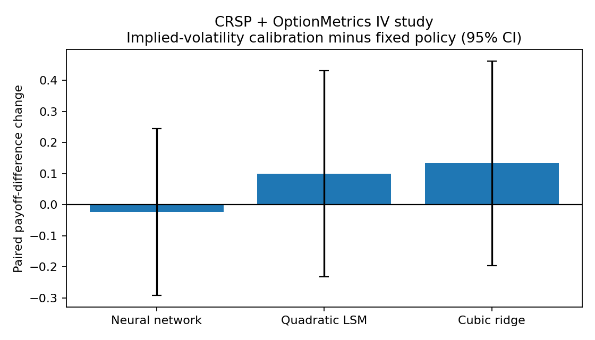

# Market-Informed Historical Stress Test of Bermudan Asian Exercise Policies

This project asks a deliberately narrow question: if an exercise policy is learned in simulation, does it still improve on holding to maturity when it is applied to a **hypothetical** Bermudan Asian put written on a realized historical stock-price path?

It is an empirical extension of [Learning Exercise Policies for Bermudan Asian Options](https://github.com/ananya-sampat/bermudan-asian-option-ml). The parent project develops and compares policies under simulated geometric Brownian motion. This repository holds the contract and policy problem fixed, then tests those decisions on realized CRSP paths and adds an OptionMetrics implied-volatility calibration.

## What is being evaluated?

For each eligible one-year CRSP path, the underlying is normalized so that the contract begins at $S_0=100$, with strike $K=100$. The arithmetic running average includes the initial price:

$$
A_t = \frac{1}{t+1}\sum_{u=0}^{t} S_u.
$$

The hypothetical Bermudan Asian put can be exercised every fifth trading day (50 exercise dates). At an exercise date, its payoff is

$$
h_t = \max(K-A_t,0).
$$

A policy observes normalized spot and average, #(S_t/K,A_t/K)$, and chooses between exercising now and continuing. If it exercises early, its payoff is carried forward to maturity using the risk-free rate available at the contract start. The central paired outcome is therefore

$$
\widetilde h_\tau-h_T,
$$

the maturity-equivalent policy payoff less the payoff from holding the same hypothetical contract to maturity. Positive values favor the policy. They are **not option prices or trading profits**.

> Bermudan Asian options are generally bespoke contracts without a directly observable historical market-price series. This study applies learned exercise policies to hypothetical contracts defined on realized CRSP underlying-price paths. Its results are realized-path policy comparisons, not direct option-pricing validation or trading-profit evidence.

## Experiments

The project evaluates quadratic Longstaff–Schwartz, cubic ridge, and small neural-network continuation models.

1. **Fixed-policy transfer.** Policies are trained under the parent project's base GBM specification: $r=5\%$, $\sigma=20\%$, one year, and 50 exercise dates.
2. **Implied-volatility calibration.** For each historical contract start, the policy is retrained with the same-day 365-day, \(-0.50\)-delta listed-put implied volatility from OptionMetrics and the last available one-year Treasury rate from FRED. The later realized CRSP path is used only for evaluation.
3. **Regime analysis.** Results are grouped by trailing one-year realized volatility and trailing one-year return, both measured before the contract begins.

The calibration uses a listed vanilla-option volatility as a market input. It does not turn the hypothetical Asian contract into a traded option.

## Main result

Across 247 eligible one-year contracts drawn from ten large U.S. equities, all three fixed policies and all three implied-volatility-calibrated policies had a positive mean realized-payoff difference relative to holding to maturity. The calibrated policies exercised less often and later, but their incremental payoff difference relative to the fixed policies was not statistically clear: every paired 95% interval includes zero.

The full tables, figures, and qualifications are in [RESULTS.md](RESULTS.md).



## Quick start: synthetic demonstration

The repository includes no licensed market data. This command runs the complete pipeline on clearly labeled synthetic data:

```bash
python -m pip install -r requirements.txt
python experiments/run_synthetic_demo.py
pytest -q
```

## Reproducing the local historical run

Place licensed files locally—never commit them—in `data/raw/`:

```text
crsp_daily.csv
dgs1.csv
optionmetrics_daily.csv
optionmetrics_security_map.csv
```

Then run:

```bash
python experiments/implied_vol_calibration.py
```

The required exports and filters are documented in [WRDS/CRSP instructions](docs/wrds_download_instructions.md) and [OptionMetrics instructions](docs/optionmetrics_download_instructions.md). The script writes local path-level results to `outputs/` and figures to `figures/`.

## Repository map

| Location | Role |
|---|---|
| `src/crsp_loader.py` | CRSP cleaning, return-index construction, and audit logging |
| `src/optionmetrics_loader.py` | Point-in-time SECID/ticker linking and one-year near-ATM IV selection |
| `src/contract_builder.py` | Hypothetical contract construction from historical paths |
| `src/policies.py` | Longstaff–Schwartz policy training |
| `src/evaluation.py` | Forward, paired realized-path evaluation |
| `src/regimes.py` | Start-date realized-volatility and return regimes |
| `experiments/` | Synthetic, fixed-transfer, rolling, and IV-calibration entry points |
| `figures/` | Reproducible figures from the reported local run |
| `RESULTS.md` | Reported aggregate results and interpretation |

## Limitations

This is an ex-post evaluation on a selected historical stock universe. It does not establish a risk-neutral value, a market price, a tradeable profit opportunity, or a universally optimal policy. The confidence intervals summarize the implemented paired sample; they do not resolve dependence across dates, model-selection uncertainty, or all economic sources of uncertainty.
