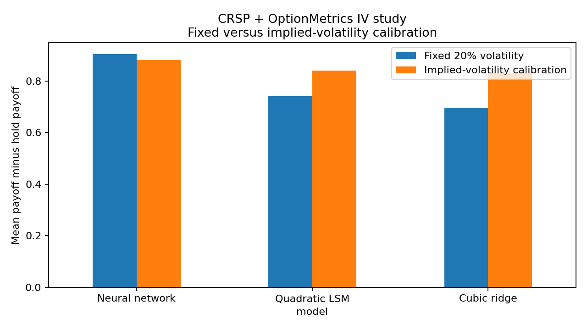
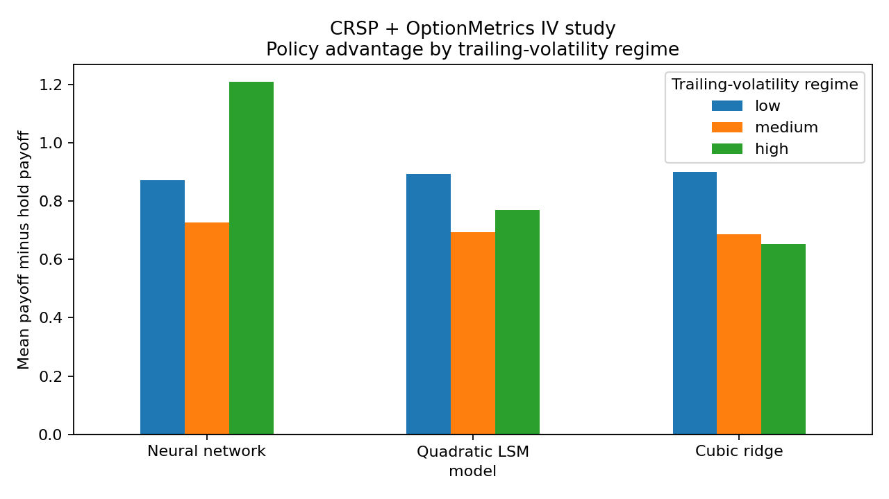
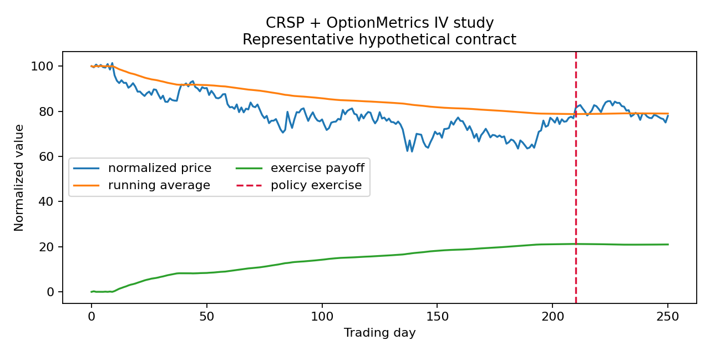

# Results

## Scope

The reported local run evaluates 247 hypothetical one-year Bermudan Asian puts constructed from realized daily CRSP paths for ten large U.S. equities. Contract start dates range from January 2001 through November 2024. Underlying prices are normalized to 100 at inception; no CRSP or OptionMetrics records are included in this repository.

The benchmark is holding the same hypothetical contract until maturity. The reported outcome is the policy payoff, carried to maturity after early exercise, minus that hold-to-maturity payoff.

## Policy payoff minus hold payoff

| Training policy | Model | Mean paired difference | 95% CI | Early-exercise rate | Mean early-exercise day |
|---|---|---:|---:|---:|---:|
| Fixed 20% volatility | Neural network | 0.903 | [0.477, 1.330] | 48.6% | 117.8 |
| Fixed 20% volatility | Quadratic LSM | 0.740 | [0.255, 1.225] | 51.4% | 112.8 |
| Fixed 20% volatility | Cubic ridge | 0.697 | [0.212, 1.181] | 50.2% | 117.2 |
| OptionMetrics IV | Neural network | 0.880 | [0.573, 1.188] | 41.3% | 141.8 |
| OptionMetrics IV | Quadratic LSM | 0.840 | [0.515, 1.164] | 43.7% | 141.0 |
| OptionMetrics IV | Cubic ridge | 0.830 | [0.501, 1.159] | 42.9% | 140.9 |

All six confidence intervals are above zero in this implemented historical-path comparison. That supports the limited statement that these policies outperformed holding the hypothetical contract to maturity on this selected realized sample.

## Does implied-volatility calibration improve on the fixed policy?

Not conclusively. The table below is the direct paired comparison: for the same contract start and model, it subtracts fixed-policy payoff advantage from implied-volatility-calibrated payoff advantage.

| Model | IV calibration minus fixed policy | 95% CI |
|---|---:|---:|
| Neural network | -0.023 | [-0.292, 0.245] |
| Quadratic LSM | 0.100 | [-0.233, 0.432] |
| Cubic ridge | 0.133 | [-0.196, 0.462] |

Every interval crosses zero. The calibration changed behavior—roughly 7–9 percentage points fewer early exercises and about 23–28 trading days later exercise when early—but did not show a statistically clear incremental realized-payoff benefit over the fixed 20% volatility policy.

## Regimes and an illustrative path

Regimes use realized volatility and return information from the one-year period before the hypothetical contract starts. These descriptive splits are useful for inspection, not evidence of a universal regime effect; the low-volatility cell is particularly small.

## Interpretation and boundaries

The OptionMetrics input is the same-day, one-year, near-at-the-money listed vanilla-put implied volatility. It is a more market-informed simulation input than a constant 20% volatility, but it is neither the price nor implied volatility of a traded Bermudan Asian option.

These results are realized-path comparisons for hypothetical contracts. They do **not** validate exotic-option market prices, show a tradeable profit, forecast future returns, or prove an optimal exercise policy.
